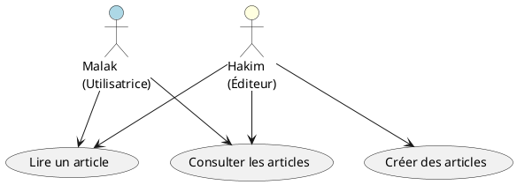

# Context 

## 🎯 **1. Contexte du projet**

Blog collaboratif dédié à l'éco-responsabilité à Agadir.
Objectif : valoriser les initiatives locales, encourager les pratiques durables et sensibiliser la communauté à la protection de l'environnement.

---

## 🎨 **2. Style & Design**

* Style moderne, épuré, inspiration nature 🌿
* Couleurs : vert doux, blanc, sable
* Mise en page pleine largeur, lisible, sans scroll inutile
* Looks magazine écologique / blog lifestyle
* Framework : Bootstrap 5 + animations douces

---

## 🧱 **3. Pages à prévoir**
### partie public :
* Accueil
* Articles / Blog
* Page Article (détails)
### partie admin :
* gerer les articles (crud)

---

## 📌 **4. Sections principales**

* Header + menu de navigation
* Hero section avec image d’Agadir + slogan
* Liste des articles (grille de cartes)
* Section communauté / appel à contribution
* Footer (liens + réseaux sociaux)

---

## 🧑‍🤝‍🧑 **5. Expérience utilisateur**

* Full responsive (mobile / tablette / desktop)
* Navigation claire et intuitive
* Page article avec zone commentaires

---

## ⚙️ **6. Technologies**

* HTML + talwaind
* CSS personnalisé
* icônes FontAwesome
* Maquette *one-page* pour chaque vue

---

## ✍️ **7. Format attendu**

* Code HTML + CSS complet
* Responsive
* Structure : 1 page = 1 fichier HTML + 1 fichier CSS associé

---

## ✅ **Travail demandé**

👉 **Fournir le plan du site**
→ Liste des pages avec uniquement : **titre + brève description**
*(sans contenu textuel détaillé)*

---

## 📊 **Diagramme de cas d'utilisation — Espace Public**

---

# Plan de site :

---

## 🗂️ **Plan du site — Blog “Agadir Green Life”**

### 🌿 **Espace Public**

| Page                        | Description                                                                   |
| --------------------------- | ----------------------------------------------------------------------------- |
| **Accueil**                 | Page d’entrée avec slogan, image d’Agadir, sections intro + derniers articles |
| **Articles / Blog**         | Liste des articles en grille (image, titre, extrait, catégories)              |
| **Détail Article**          | Page individuelle : contenu, auteur, images, section commentaires             |
| **Page Catégorie (non)** | Affiche les articles filtrés par thème (ex: recyclage, tourisme vert…)        |
| **Page À propos (non)**  | Objectif du projet, mission, vision, valeurs                                  |
| **Page Contact (non)**   | Formulaire simple : nom, email, message                                       |

---

### 🔐 **Espace Administrateur / Éditeur**

| Page                     | Description                                             |
| ------------------------ | ------------------------------------------------------- |
| **Dashboard Admin**      | Accueil admin : résumé (articles publiés, brouillons…)  |
| **Liste des Articles**   | Tableau des articles (titre, date, statut, actions)     |
| **Créer un Article**     | Formulaire de création article (titre, contenu, image…) |
| **Modifier un Article**  | Édition d’un article existant                           |
| **Supprimer un Article** | Suppression avec confirmation                           |

---

### 🛠️ **Fonctionnalités Clés**

✅ CRUD articles (Admin/Éditeur)
✅ Affichage articles avec images
✅ Page article avec commentaires
✅ Responsive full-width design
✅ Style nature, doux, moderne

